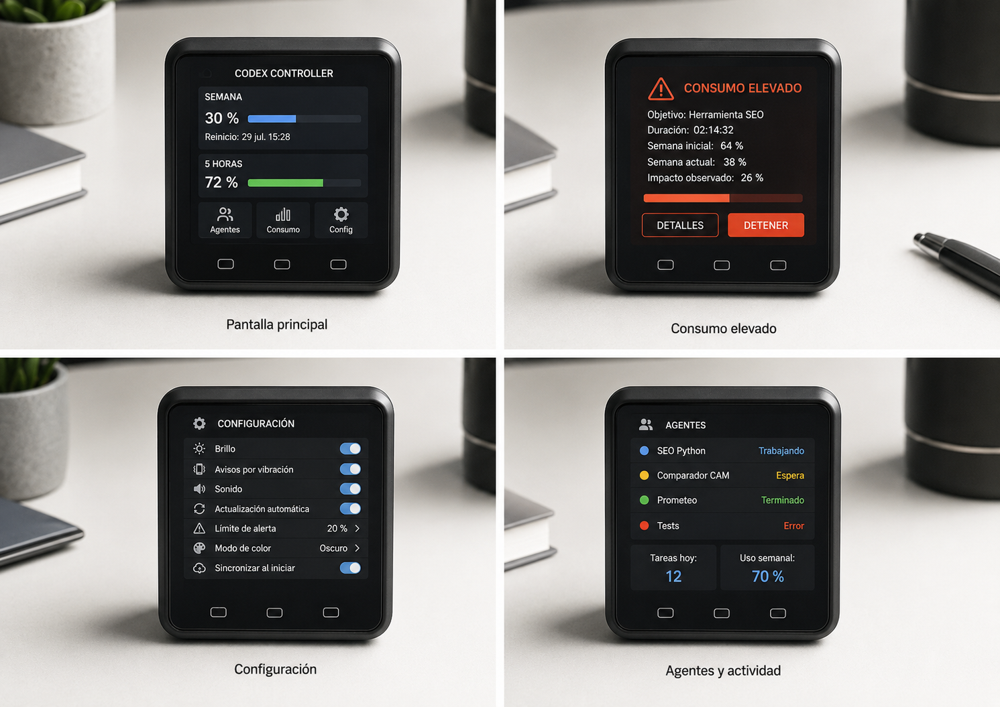

# Agent Control Hub

Controlador físico y servicio local para supervisar agentes de inteligencia artificial desde un M5Stack Core2.



## Objetivo

Agent Control Hub reúne en una sola pantalla el estado de plataformas como Codex, Hermes, OpenClaw, Qwen Code y otros agentes locales o remotos. El dispositivo muestra actividad, consumo, costes, límites y alertas sin obligar al usuario a mantener abierto un panel adicional.

El proyecto se divide en dos piezas:

- **Agent Control Service**: servicio local modular que normaliza los datos de cada plataforma y los envía por USB serie.
- **Firmware Core2**: interfaz para M5Stack Core2 con pantalla principal, consumo elevado, agentes y configuración.

## Estado actual

Este primer commit contiene un MVP técnico con:

- Arquitectura desacoplada por adaptadores.
- Adaptador de demostración con datos simulados.
- Protocolo NDJSON versionado entre ordenador y dispositivo.
- Servicio Python ejecutable desde consola.
- Firmware inicial para M5Stack Core2 mediante PlatformIO.
- Pantallas de resumen, alerta, agentes y configuración.
- Pruebas unitarias del protocolo y agregación.
- Flujo de integración continua para Python y firmware.

Los conectores reales de Codex, Hermes, OpenClaw y Alibaba/Qwen se incorporarán de forma independiente. El proyecto no inventará datos cuando una plataforma no exponga cuota o fecha de reinicio.

## Arquitectura

```text
Codex ─────────┐
Hermes ────────┤
OpenClaw ──────┤   Adaptadores       Modelo común       USB serie
Qwen/Alibaba ──┼───────────────► Agent Control Service ───────────► M5Stack Core2
Otros ─────────┘
```

Consulta [la arquitectura técnica](docs/architecture.md) y [el protocolo del dispositivo](docs/protocol.md).

## Inicio rápido del servicio

Requiere Python 3.11 o superior.

```powershell
cd service
python -m venv .venv
.venv\Scripts\Activate.ps1
python -m pip install -e ".[dev]"
agent-control --once --mock
```

Para transmitir datos a un Core2 conectado:

```powershell
agent-control --mock --port COM5 --interval 5
```

## Compilar el firmware

Requiere Visual Studio Code con PlatformIO o PlatformIO CLI.

```powershell
cd firmware/core2
pio run
pio run --target upload
pio device monitor --baud 115200
```

## Principios del proyecto

- Los datos oficiales se diferencian siempre de las estimaciones.
- Las credenciales permanecen en el ordenador y nunca se envían al microcontrolador.
- El firmware no conoce detalles internos de cada plataforma.
- Los conectores pueden activarse o desactivarse de forma independiente.
- El modo demostración permite desarrollar la interfaz sin cuentas reales.
- El dispositivo debe seguir siendo útil aunque una integración deje de funcionar.

## Hardware objetivo inicial

- M5Stack Core2.
- Cable USB-C.
- Ordenador Windows con el servicio local.

Una posible versión posterior podrá utilizar M5Stack CoreS3 o una PCB propia basada en ESP32-S3.

## Licencia

Apache License 2.0. Consulta [LICENSE](LICENSE).
